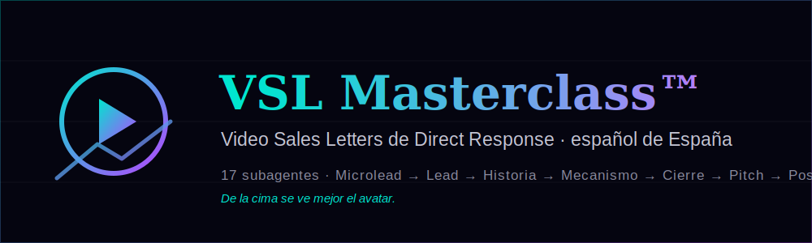

<div align="center">



# VSL Masterclass · Plugin Claude Code

</div>

Sistema completo de agentes Claude Code para construir Video Sales Letters (VSL), microleads, leads, landing pages y campañas de Direct Response en español de España. **Creado por Joseph Moreno** a partir de formaciones de Brasil, EE.UU. y España combinadas con experiencia operativa propia.

Un orquestador padre coordina **17 subagentes especializados** + **4 skills de conocimiento compartido**. Cada agente domina una pieza del puzzle: desde detectar el nivel de consciencia del lead hasta diseñar el Complejo del Play Rate de tu landing.

---

## Instalación

```bash
claude /plugin install https://github.com/zenithmetodo/vsl-masterclass
```

Después de instalar:

```bash
# El orquestador padre — punto de entrada recomendado
/vsl-masterclass:vsl-master

# O invoca un agente concreto directamente
@agent-vsl-masterclass:vsl-headline
```

---

## Arquitectura

```
┌──────────────────────────────────────────────────────────────┐
│                      vsl-master (PADRE)                       │
│  Detecta intent, hace preguntas, decide qué agente lanzar     │
│  y compone la respuesta final                                 │
└──────────────────────────────────────────────────────────────┘
                              │
        ┌────────────┬────────┴────────┬────────────┐
        ▼            ▼                 ▼            ▼
   PRE-VSL       VSL CORE         POST-VSL       RESEARCH
        │            │                 │            │
  ┌─────┴─┐    ┌─────┴─────┐    ┌──────┴──┐  ┌─────┴──────┐
  │detector│   │microlead  │    │ landing │  │ trends     │
  │niveles │   │headline   │    │mini-vsl │  │ ad-library │
  └────────┘   │lead       │    │info-nutra│  │ test-ab    │
               │structure  │    │post-pitch│  └────────────┘
               │historia   │    └─────────┘
               │mecanismo  │
               │cierre     │
               │psicologia │
               └───────────┘
```

---

## Agentes incluidos

### Orquestador
| Agente | Qué hace |
|---|---|
| `vsl-master` | Padre. Pregunta el nicho, el avatar, el objetivo. Decide qué agentes lanzar y en qué orden. Compone la respuesta final. |

### Pre-VSL (research + estrategia)
| Agente | Qué hace |
|---|---|
| `vsl-detector-consciencia` | Detecta nivel de consciencia (Schwartz) del lead objetivo. Propone tipo de Lead idóneo. |
| `vsl-info-nutra` | Decide la estrategia: Info digital vs Nutra encapsulado. Adapta a España. |
| `vsl-research-trends` | Busca tendencias en Google Trends y YouTube para encontrar nichos calientes. |
| `vsl-research-ads` | Investiga la Meta Ads Library y swipe files (American Swipe, Seven Swipe) para extraer ofertas validadas. |

### VSL Core (estructura + copy)
| Agente | Qué hace |
|---|---|
| `vsl-structure` | Diseña la estructura completa del VSL (15 pasos canónicos) según el nivel de consciencia. |
| `vsl-microlead` | Crea microleads de 10-12s para anuncios — el primer impacto antes del lead. |
| `vsl-lead` | Genera leads usando uno de los 6 tipos canónicos del libro Great Leads (Masterson + Forde). |
| `vsl-headline` | Construye headlines con la trinity Beneficio + Credibilidad + Curiosidad. |
| `vsl-historia` | Diseña la sección historia / autoridad / protagonista según el perfil narrador. |
| `vsl-mecanismo` | Construye el "mecanismo único" (el cómo funciona) — clave para subir credibilidad. |
| `vsl-cierre` | Diseña el cierre agresivo: precio, garantía, escasez, urgencia. |
| `vsl-post-pitch` | Sección post-pitch: "ya hice todo lo que podía. La decisión es tuya". |
| `vsl-psicologia` | Loops mentales, Reason to stay, Reset on two state, Promesas de tiempo. |

### Página + Optimización
| Agente | Qué hace |
|---|---|
| `vsl-landing` | Diseña la landing: Complejo del Play Rate (Headline + Autoplay + Vídeo de Fondo), escasez y urgencia legítima. |
| `vsl-mini-vsl-quiz` | Construye mini VSLs y quizzes (estructura Keps) para ofertas low-ticket. |
| `vsl-test-ab` | Metodología de tests A/B con relevancia estadística. |

### Auditoría (peer review)
| Agente | Qué hace |
|---|---|
| `vsl-peer-review` | Editor senior. Audita cualquier pieza generada (Lead, Microlead, Mecanismo, Cierre, Headline, VSL completa) y devuelve **Keep list + Fix list** con los 10 defectos canónicos del masterclass (Cap. 39), propuesta de fix concreta y agente al que derivar la regeneración. Se lanza automáticamente después de cada generación importante. |

---

## Skills compartidas (conocimiento de referencia)

Cualquier agente puede precargarlas. Son la "base de conocimiento" del masterclass.

| Skill | Contenido |
|---|---|
| `vsl-niveles-consciencia` | Los 5 niveles de Eugene Schwartz + qué tipo de Lead usar en cada uno. |
| `vsl-tipos-de-lead` | Los 6 tipos canónicos del libro Great Leads (Masterson + Forde). |
| `vsl-formula-bencivenga` | Beneficio + Credibilidad − Costo = Persuasión. |
| `vsl-direct-response-glossary` | Glosario: VSL, Lead, Microlead, Pitch, Loop, Mecanismo, Nutra USA, Info, etc. |

---

## Knowledge — el masterclass completo en markdown

La carpeta `knowledge/` contiene **las 15 clases del masterclass + la Biblia del Mecanismo (clases 16-17)** en markdown limpio (sin HTML, sin CSS). Cada agente puede leer estos archivos on-demand cuando necesita profundidad — un ejemplo exacto, un % concreto, un nombre de framework, una transcripción literal de una sección.

| Archivo | Tema |
|---|---|
| `knowledge/00-INDEX.md` | Índice maestro + mapeo clase → agentes que la usan |
| `knowledge/01-fundamentos.md` | Fundamentos del copywriting de Direct Response |
| `knowledge/02-metodo-practico.md` | Método práctico de trabajo |
| `knowledge/03-arsenal-formatos.md` | Arsenal de formatos de microlead |
| `knowledge/04-anatomia-lead.md` | Anatomía del Lead + 6 tipos canónicos |
| `knowledge/05-construccion-leads.md` | Construcción de leads |
| `knowledge/06-taller-lead.md` | Taller práctico de Leads |
| `knowledge/07-reglas-dr.md` | Reglas operativas del Direct Response |
| `knowledge/08-cierre-agresivo.md` | Cierre agresivo + post-pitch |
| `knowledge/09-info-vs-nutra.md` | Info vs Nutra + estrategia España |
| `knowledge/10-paginas-agresivas.md` | Landings agresivas |
| `knowledge/11-mini-vsl-quiz.md` | Mini VSLs + quiz funnels |
| `knowledge/12-headlines.md` | Headlines de VSL |
| `knowledge/13-complejo-play-rate.md` | Complejo del Play Rate |
| `knowledge/14-psicologia-vsl.md` | Psicología del VSL |
| `knowledge/15-sistema-optimizacion.md` | Sistema de optimización + tests A/B |
| `knowledge/16-biblia-del-mecanismo.md` | ⭐ **La Biblia del Mecanismo** — 131 formaciones destiladas: las 4 capas, mecanismo del problema/solución, causa raíz, objeto brillante, nombre chicle, mito de origen, 50+ ejemplos |
| `knowledge/17-mecanismo-en-la-vsl.md` | ⭐ **Mapa pieza → paso** — dónde colocar cada pieza del mecanismo dentro de la VSL **si el usuario trae su oferta ya construida** (intake OPCIONAL · si no la tiene, la VSL se hace igual) |

> **Mecanismo + Oferta:** si ya tienes tu oferta construida (desde `zenith-crea-ofertas`), los agentes de VSL colocan cada pieza (mecanismo, causa raíz, objeto brillante, nombre chicle, mito de origen…) en su paso exacto según el mapa de la clase 17. Si no la tienes, no pasa nada: la VSL se construye con normalidad y la Biblia queda como referencia.

**Diferencia con skills:**
- **Skills** = conocimiento *siempre precargado* en el agente al iniciar (frameworks core, glosario).
- **Knowledge** = conocimiento *consultable on-demand* (ejemplos, casos, transcripciones completas).

Esto mantiene los agentes rápidos y ligeros, mientras te da acceso al masterclass entero cuando lo necesitas.

---

## Cómo se llaman entre sí

El padre `vsl-master` recibe la petición del usuario y, según lo que detecte, lanza uno o varios subagentes en paralelo o en secuencia.

Ejemplo: el usuario dice *"quiero una VSL completa para un suplemento de próstata en España"*.

1. `vsl-master` pregunta lo mínimo (nicho ✓, mercado ✓, falta: avatar, oferta, presupuesto)
2. Lanza en paralelo:
   - `vsl-detector-consciencia` → "Consciente del problema"
   - `vsl-info-nutra` → "Mejor empezar Info digital 17€ con VSL Nutra USA traducida"
   - `vsl-research-ads` → busca VSLs ganadoras en swipe files
3. Cuando tiene la estrategia, lanza secuencialmente:
   - `vsl-structure` → 15 pasos del VSL
   - `vsl-headline`, `vsl-microlead`, `vsl-lead`, `vsl-historia`, `vsl-mecanismo`, `vsl-cierre` (en paralelo)
   - `vsl-landing` → diseña la página
   - `vsl-test-ab` → plan de tests

---

## Filosofía

Este plugin **no inventa**. Cada agente está construido a partir del masterclass real impartido en español. Las recomendaciones siguen exactamente:

- Eugene Schwartz (Breakthrough Advertising)
- Michael Masterson + John Forde (Great Leads)
- Gary Bencivenga (fórmula Beneficio + Credibilidad − Costo)
- Joe Sugarman (el tobogán engrasado)
- Stephan Georgia (RMBC framework)
- Joseph Moreno (experiencia operativa en Brasil, EE.UU. y España — síntesis del masterclass)

---

## Licencia

MIT — usa, modifica, distribuye. Atribución apreciada.

**Autor:** Joseph Moreno
**Año:** 2026
